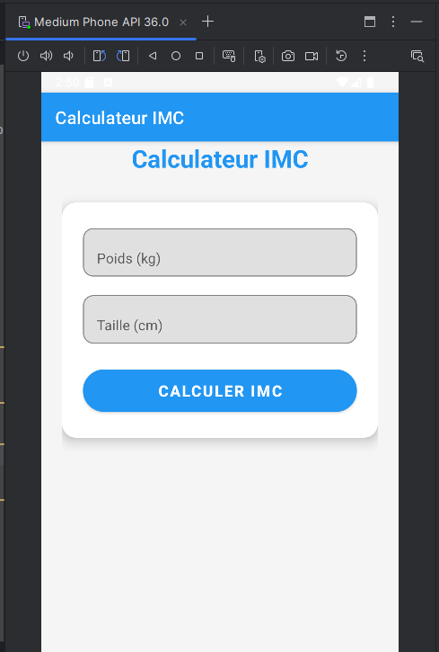
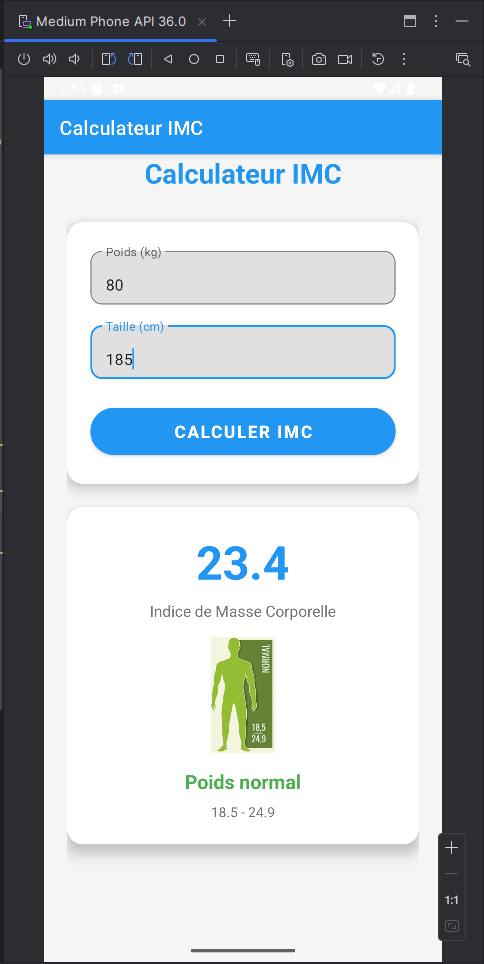
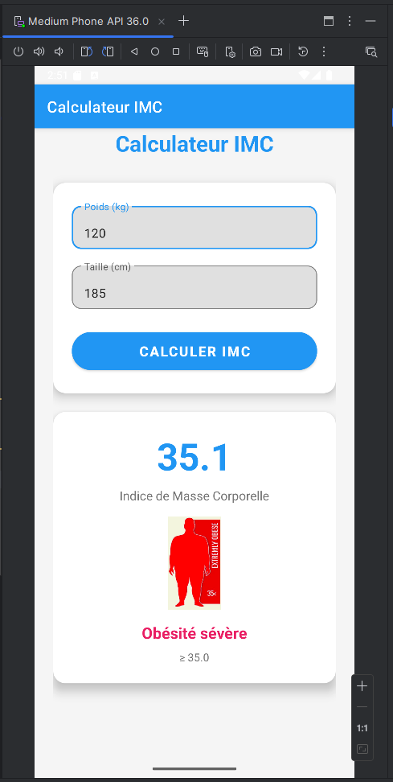

# BMI Calculator Android App

## 📱 Description

BMI Calculator (Calculateur IMC) is a modern Android application that allows users to calculate their Body Mass Index (BMI) and determine their weight category.

## 📊 BMI Categories

| Category | BMI Range | Color | Icon |
|----------|-----------|-------|------|
| Underweight | < 18.5 | Blue | ic_underweight.png |
| Normal Weight | 18.5 - 24.9 | Green | ic_normal.png |
| Overweight | 25.0 - 29.9 | Orange | ic_overweight.png |
| Obesity | 30.0 - 34.9 | Red | ic_obesity.png |
| Severe Obesity | ≥ 35.0 | Pink | ic_obesity_severe.png |

## 📸 Screenshots

<!-- Add your screenshots here -->
### Main Interface

*Clean input interface with Material Design components*

### BMI Results

*Example of normal weight category result*

*Example of overweight category result*

## 🛠️ Technical Details

### Development Environment
- **IDE**: Android Studio
- **Language**: Kotlin
- **Min SDK**: API 21 (Android 5.0)
- **Target SDK**: API 34 (Android 14)
- **Build System**: Gradle

### Key Components
- **MainActivity.java**: Main application logic and BMI calculation
- **Material Components**: Modern UI elements (TextInputLayout, CardView, etc.)
- **Resource Management**: Organized strings, colors, and drawable resources
- **Responsive Design**: Constraint and Linear layouts for different screen sizes

*This app was developed as part of the Native Android Mobile Development course at ENSET, Hassan II University of Casablanca.*
